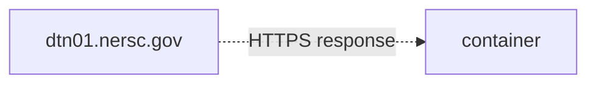
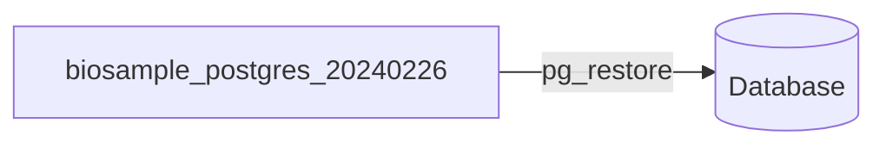

# Restoring a compressed SQL dump residing on `dtn01.nersc.gov` into a Spin-hosted container running Postgres

Here's how you can restore a compressed SQL dump originally residing on `dtn01.nersc.gov`, into a Postgres server running as a container on the [NERSC Spin](https://www.nersc.gov/systems/spin/) platform.

### Preconditions

1. The compressed SQL dump file is a `.tar.gz` file containing a SQL dump. The SQL dump was generated by version 16 of `pg_dump`, using the `-F c` option.
2. The compressed SQL dump file resides on `dtn01.nersc.gov`, at the path: `/global/cfs/cdirs/m3408/temp/biosample_postgres_20240226.tar.gz`.
3. The SQL dump file (i.e. the file _within_ in the compressed one) is named: `biosample_postgres_20240226`
4. You want to restore the SQL dump into a database named: `ncbi_biosamples_feb26`
5. The Spin-hosted container is running the [off-the-shelf `postgres:15` image](https://hub.docker.com/_/postgres).
6. The Spin-hosted container already has a Rancher-provided persistent disk mounted within it.
   > Note: If it didn't, you could just "bind-mount" the directory (containing the compressed SQL dump file) directly within the container.

### Procedure

Notes:
- You can access the shell of `dtn01.nersc.gov` by SSH-ing to it.
- You can access the shell of the container by using Rancher's "Execute shell" feature.
  > Advanced: You can also access it by using `kubectl` with a `KubeConfig` file that you download from Rancher.

#### I. Prepare the container

1. Install `curl` within the container.

   ```shell
   apt update && apt install -y curl
   ```

2. Update `pg_restore` to version 16 within the container.

   ```shell
   apt update && apt install -y postgresql-client-16
   
   # (Optional) Check the version.
   pg_restore --version
   ```
   > Note: This step is necessary because—as mentioned in the "Preconditions" section—the dump was generated using version 16 of `pg_dump`, while the container has version 15 of `pg_restore` installed by default. Using the latter with the dump would result in this error:
   > ```console
   > pg_restore: error: unsupported version (1.15) in file header
   > ```

#### II. Get the compressed SQL dump file into the container



1. **On `dtn01.nersc.gov`:** Move the file into the [WWW-accessible](https://www.nersc.gov/assets/Uploads/09-Data-Storage-and-Sharing-2022.pdf) directory and make the file readable by "others".

   ```shell
   mv /global/cfs/cdirs/m3408/temp/biosample_postgres_20240226.tar.gz \
      /global/cfs/cdirs/m3408/www
   
   chmod o+r /global/cfs/cdirs/m3408/www/biosample_postgres_20240226.tar.gz
   ```

2. **In the container:** Download the file via HTTPS.

   ```shell
   cd /tmp
   curl -o /tmp/biosample_postgres_20240226.tar.gz \
        https://portal.nersc.gov/project/m3408/biosample_postgres_20240226.tar.gz
   ```
   > When I did this for a 3.4 GB file, the download took 12 seconds.

3. **On `dtn01.nersc.gov`:** Move the file out of the WWW-accessible directory.

   ```shell
   mv /global/cfs/cdirs/m3408/www/biosample_postgres_20240226.tar.gz \
      /global/cfs/cdirs/m3408/temp
   ```
   > You can, alternatively, delete the file entirely; i.e. `$ rm /global/cfs/cdirs/m3408/www/biosample_postgres_20240226.tar.gz`.

#### III. Extract the SQL dump file


1. Within the container, extract the contents of the compressed SQL dump file.

   ```shell
   tar -xzf /tmp/biosample_postgres_20240226.tar.gz
   
   # (Optional) Check the contents of the directory.
   ls -lh
   ```
   > That will extract the contents into the current directory. You can specify a directory into which you want the file to be extracted, by    include the `-C /path/to/destination` option.

#### IV. Restoring the SQL dump into the Postgres server



Do these steps **within the container**:

1. Create the database.

   ```shell
   createdb -U postgres ncbi_biosamples_feb26
   ```

2. Create the `biosample` role, which is referenced within the SQL dump.

   ```shell
   psql -U postgres
   ```
   ```sql
   -- At the `psql>` prompt:
   CREATE ROLE biosample;
   
   -- Quit `psql`.
   \q
   ```

3. Restore the data from the SQL dump file.

   ```shell
   pg_restore -U postgres -d ncbi_biosamples_feb26 /tmp/biosample_postgres_20240226
   ```
   > When I did that, `pg_restore` did not output anything. I determined the operation was done when the prompt finally reappeared, which took somewhere **between 20 minutes and 4 hours** (I don't know exactly). When I did it, I was using a SQL dump file that was 4.1 GB (the compressed SQL dump file was 3.4 GB).